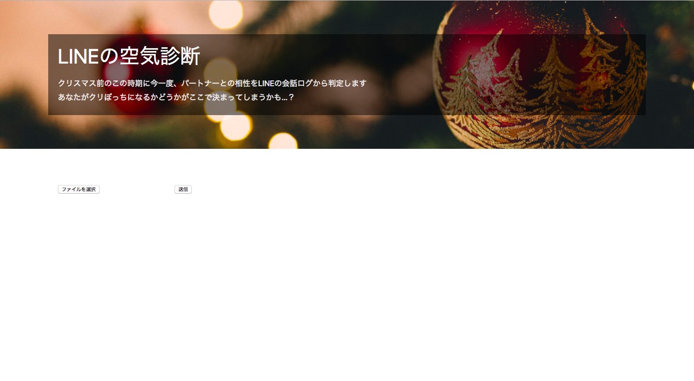
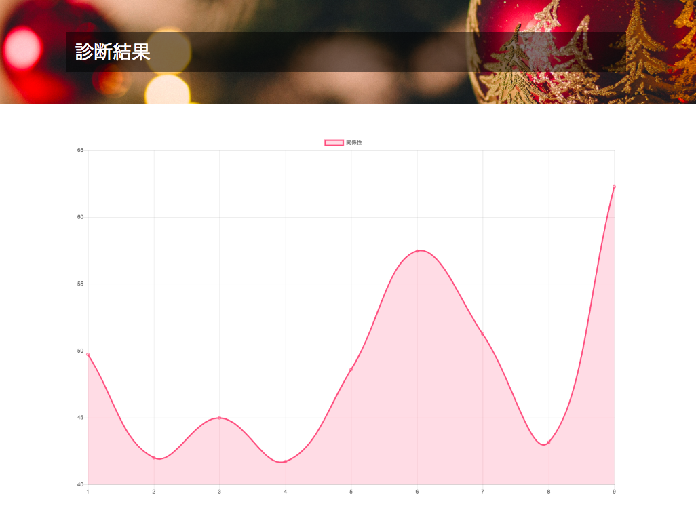

# christmas_line_analyze
[第１回WEハッカソン](https://connpass.com/event/110687/)の際に作成    

# 概要
LINEのトーク履歴から相手のテンションが過去１週間ごとにどのように推移してきたかをグラフ化して表示してくれるアプリ。  

# 使用技術
- Watson API(Personality Insights)
- Python
- Flask
- Chart.js

# 使用方法
1.watson API_KEYに自分のものを代入  

2.LINEのトーク履歴（.txt）をLINEアプリ上（設定）から取得し、同ディレクトリ内に置く

3.render.1.pyを起動  

```py
$ python render.1.py
```

4. http://127.0.0.1:5000/にアクセス



5.ファイルを選択からtxtファイルを選択

6.コンソール上でも同じファイルを選択

7.結果出力



# 共同開発者
taichi(@seven0525)  
hama(@mkdkkn)
